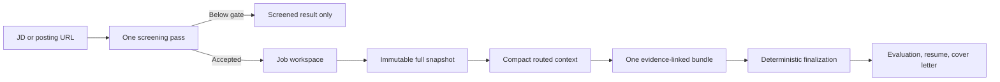

# JobSensei Product Flows

This guide explains what happens inside JobSensei, why each workflow is bounded, and where users can safely customize behavior. The main [README](README.md) covers installation and the product overview; this document covers operation.

## Core Model

JobSensei separates four concerns:

| Layer | Purpose | Authority |
| --- | --- | --- |
| Candidate profile | Identity, chronology, preferences, source locations | Local `data/profile/candidate.json` |
| Career context | Detailed facts about work, projects, education, and skills | User-selected files under `data/context/` |
| Agy skills | Instructions for screening, drafting, and interview preparation | Public `.agents/skills/` files |
| Deterministic app code | File safety, protected resume composition, validation, viewing, and PDF export | Electron main process |

The base resume protects presentation and fixed career fields. It is not trusted as proof of every bullet. Selected structured context is the primary factual source, while broad context, LinkedIn, and secondary resumes have narrower supporting roles.

## First Launch

1. JobSensei creates the local `data/` workspace.
2. The Get Started screen collects a name and artifact prefix.
3. The user selects a base resume.
4. Career evidence is added under `data/context/structured/`; source notes may be added under `data/context/broad/`.
5. The app creates an active context manifest from the files selected in the interface.
6. The Command Center launches Agy from the repository root so it can discover `.agents/skills/`.

Personal information belongs in the ignored `data/` workspace. Public skills must remain candidate-neutral.

## Job Application Flow

**Trigger:** paste a JD or direct posting URL into Agy.

**Orchestrator:** `jobsensei-application-pipeline`

The snapshot command stores a complete private verification archive. It also creates a compact drafting packet containing the same selected claims needed for the job without repeating full profile, route, source, and policy data. Agy reads that packet once and writes one `application_bundle.json`, with evidence IDs beside each generated claim.

The finalizer then:

- restores protected identity, contact details, employers, titles, dates, locations, education, and structure from the base-resume baseline;
- derives the hidden draft and evidence map without another AI pass;
- calculates the authoritative score and diagnostics;
- writes the reviewable Markdown resume, cover letter, and evaluation;
- stops after one attempt, even when review warnings exist.

This structure keeps Agy fast without making it blind: evidence coverage remains in the immutable snapshot, while only duplicate metadata and repeated instructions are removed from the model-facing packet.

### Application Skills

| Skill | When to use it | Responsibility |
| --- | --- | --- |
| `jobsensei-application-pipeline` | New JD or URL | Sole application orchestrator and normal entry point |
| `jobsensei-job-intake` | Existing approved job or metadata refresh | Normalizes an already accepted workspace |
| `jobsensei-job-match` | Explicit reevaluation | Updates the single evaluation document |
| `jobsensei-resume-tailor` | Explicit resume-only revision | Revises editable resume content from pinned evidence |
| `jobsensei-application-writer` | Explicit letter or short-answer revision | Revises application prose without running the full pipeline |
| `jobsensei-career-evidence` | Evidence maintenance or truth review | Structures, inspects, and audits factual career evidence |

The narrower skills do not run automatically during a new-JD flow. This prevents repeated reading, duplicate artifacts, and conflicting instructions.

## Review And PDF Flow

Generated Markdown is a draft for human review. Users can open and edit Markdown in the document viewer. PDF export begins only when the user clicks the export action.

The exporter uses artifact-specific layouts, checks page count and extraction, and preserves the previous valid PDF if a new export fails. Evidence and internal warnings stay out of employer-facing files.

## Interview Flow

**Trigger:** explicitly ask Agy to prepare an existing job for an interview.

**Orchestrator:** `jobsensei-interview-pipeline`

The interview pipeline resolves one existing job, identifies the requested stage, researches the company or process when appropriate, and creates stage-aware `research.md`, `prep.md`, and `question_bank.md` files. A pasted JD never activates this flow.

| Skill | Responsibility |
| --- | --- |
| `jobsensei-interview-pipeline` | Creates or advances round-specific preparation |
| `jobsensei-interview-coach` | Runs text mocks, improves answers, and creates feedback or debrief analysis |
| `jobsensei-technical-challenge` | Creates labs or scenarios only after an explicit challenge/test request |

Recruiter and hiring-manager preparation emphasizes career narrative, motivation, scope, customer work, and logistics. Technical preparation emphasizes systems, debugging, implementation choices, and supported project depth. Challenge material is kept separate until explicitly requested.

Raw transcripts remain performance records. They do not become career evidence automatically.

## Context Selection

The UI checkboxes determine which career and job files appear in the active manifest. Structured and broad files are separate so users can control precision versus clarification.

Best practices:

- Keep structured evidence atomic, dated, scoped, and tied to a source locator.
- Record contribution honestly: distinguish built, contributed, tested, supported, and led.
- Put disputed or exaggerated claims in the denylist instead of relying on memory.
- Select only job files intentionally; unrelated jobs can contaminate wording.
- Use broad source files to clarify structured evidence, not as duplicate corroboration.
- Refresh the context manifest after changing source selection before starting a new Agy task.

## Customizing Skills

Skills are Markdown instructions under `.agents/skills/<skill-name>/SKILL.md`. Users may edit them, but should keep candidate facts out of public skill files.

Safe customization sequence:

1. Put personal identity, chronology, output preferences, and source paths in `data/profile/candidate.json`.
2. Put factual work details in structured context and writing preferences in the configured voice profile.
3. Change a skill only when the workflow itself should behave differently for every candidate.
4. Prefer replacing or shortening a conflicting rule over adding another rule at the end.
5. Keep one skill as the orchestrator for each flow; do not make it reread downstream skills during normal execution.
6. Keep fixed validation and file composition in TypeScript rather than asking Agy to reason about implementation code.
7. Test changes with fictional fixtures before using private applications.

Avoid embedding names, employers, exact personal claims, credentials, or machine-specific paths in `.agents/`, `AGENTS.md`, tests, or examples. Those files are intended to be safe to publish.

## Performance Principles

- Start a fresh Agy task for each JD.
- Use low reasoning for routine application drafting; increase it only for an unusually complex role.
- Keep the application sequence to one fetch, one intake batch, one snapshot, one context read, one bundle write, and one finalization.
- Do not inspect validators or source code during a routine application.
- Treat warnings as review information, not as an invitation to repair automatically.
- Never regenerate all artifacts merely to fix hidden timestamps or validation metadata.

## Privacy Boundary

The repository ignores `data/`, local plans, environment files, build output, and caches. Before publishing a fork, inspect the complete tracked-file list and run credential and identity scans. The fictional workspace under `examples/` is the only candidate data intended for source control.

See [Privacy](docs/privacy.md), [Workspace Format](docs/workspace-format.md), and [Security](SECURITY.md) for the supporting contracts.
