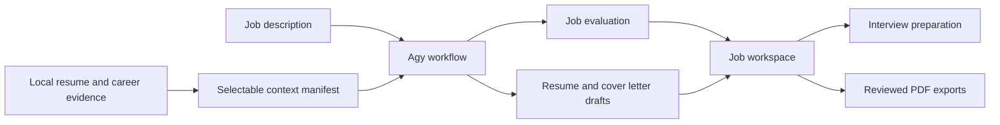

# JobSensei

**A local-first career workspace for grounded job applications and interview preparation.**

JobSensei brings a candidate's resume, career evidence, job applications, and interview materials into one desktop workspace. It combines a document viewer, job dashboard, embedded terminal, and reusable Agy workflows without uploading the local career library to a hosted application.

I built JobSensei to solve a recurring problem in AI-assisted job searching: a resume is only a narrow summary of someone's experience, while the useful evidence is spread across project notes, older roles, education, and past work. JobSensei makes that broader context selectable, reviewable, and available to structured workflows.

## What It Does

- Organizes career context, resumes, job workspaces, and interview artifacts locally.
- Previews Markdown, text, JSON, PDF, DOCX, images, and other common career files.
- Runs Agy from an embedded terminal with the repository's JobSensei skills available.
- Screens job descriptions before creating an application workspace.
- Produces reviewable evaluations, tailored resume drafts, and cover letters.
- Supports recruiter, hiring-manager, technical, and technical-challenge preparation.
- Exports reviewed Markdown resumes and cover letters to PDF.
- Keeps candidate data outside the public source tree by default.

## Product Flow



The base resume protects identity, chronology, and presentation. Selected structured context provides factual career evidence. Agy applies the workflow; deterministic Electron code handles local files, validation, navigation, and export.

## Engineering Highlights

- **Local-first privacy:** candidate data lives under the Git-ignored `data/` directory.
- **Process isolation:** React receives narrow typed APIs through Electron preload instead of direct filesystem access.
- **Evidence-aware workflows:** selected context is represented by a manifest and bounded job-scoped snapshot.
- **Defensive documents:** previews validate workspace paths and safely handle malformed or unsupported files.
- **Recoverable output:** public drafts remain reviewable, and failed exports preserve the last valid PDF.
- **Cross-platform operation:** terminal and filesystem behavior support macOS and Windows.
- **Regression coverage:** synthetic fixtures test application rules without depending on private career data.

## Architecture

| Layer | Responsibility |
| --- | --- |
| React renderer | Workspace navigation, dashboards, document viewing, editing, and terminal presentation |
| Electron preload | Narrow, typed bridge between the interface and local capabilities |
| Electron main | Filesystem safety, workspace state, terminal sessions, document parsing, and PDF export |
| Local workspace | Candidate profile, resumes, career context, jobs, interviews, and hidden runtime state |
| Agy skills | Job screening, grounded drafting, interview preparation, and workflow orchestration |

JobSensei itself does not call a hosted AI provider. Agy is the only AI execution layer in this release.

## Requirements

- macOS 13+ or Windows 10/11
- Node.js 22+
- npm
- Agy on `PATH` for AI-assisted workflows

The viewer, dashboards, local organization, Markdown editing, search, and PDF export remain useful without Agy. Application and interview generation require Agy to be installed and authenticated separately.

## Install

```bash
git clone <your-repository-url>
cd JobSensei
npm install
npm run dev
```

The first launch creates the private workspace automatically:

```text
data/
  profile/
  resumes/
  context/
  jobs/
  debrief/
  .sensei/
```

## Get Started

1. Enter your name and artifact filename prefix on the in-app Get Started screen.
2. Select a Markdown, PDF, or DOCX base resume with the native file picker.
3. Add normalized evidence to `data/context/structured/` and optional source material to `data/context/broad/` using Finder, File Explorer, or the terminal.
4. Return to JobSensei; the workspace watcher refreshes the context view automatically.
5. Confirm that Agy is available, then open the Command Center.

JobSensei creates `data/profile/candidate.json`; users do not need to create it manually. The profile stores identity, source paths, chronology, and writing preferences, while detailed career facts remain in the context files.

See [Workspace Format](docs/workspace-format.md) for the local data contract.
See [Product Flows](PRODUCT_FLOWS.md) for an end-to-end explanation of each workflow, the skills involved, and safe customization practices.

## Try The Fictional Example

[`examples/demo-workspace/`](examples/demo-workspace/) contains a fictional candidate, job application, and interview round. It demonstrates the expected folder and artifact formats without exposing real candidate data. The example is intended for code review and exploration; normal onboarding creates a separate private `data/` workspace.

## Application Workflow

Paste a job description or direct posting URL into Agy from the Command Center. The `jobsensei-application-pipeline` skill:

1. Screens the role against the selected career evidence.
2. Creates a job workspace only when the configured rating gate passes.
3. Pins one job-scoped evidence snapshot.
4. Drafts the evaluation, resume content, and cover letter once.
5. Finalizes once and stops with visible review findings.

Review the generated Markdown in JobSensei before exporting a PDF. A failed diagnostic never starts an automatic repair loop.

## Interview Workflow

After a job reaches interview stage, a short Agy prompt such as `Example Labs interview` creates stage-aware research, preparation, and a question bank inside the existing job workspace. Technical challenge practice is created only when explicitly requested. Text mocks, transcripts, and debrief analysis remain available; this release does not include live voice assistance.

## Privacy And Security

- `data/`, `debrief/`, `.sensei/`, `.env`, build output, and local planning files are ignored by Git.
- Candidate documents are processed locally by the Electron application.
- The browser-facing renderer does not receive unrestricted filesystem access.
- Agy runs with the local permissions of the user operating the embedded terminal.
- JobSensei does not connect an email account or bundled model provider.

Read [Privacy](docs/privacy.md) and [Security](SECURITY.md) before adding sensitive files or publishing a fork.

## Development

```bash
npm run typecheck
npm run test
npm run build
```

GitHub Actions runs these checks on both macOS and Windows. Tests use fictional candidates and temporary workspaces rather than private application data.

## Roadmap

- In-app context importing and candidate-profile editing
- More guided first-run evidence setup
- Improved renderer code splitting and startup performance
- Optional integrations evaluated separately from the privacy-focused core

## Known Limitations

- This is a source release, not a signed desktop installer.
- Agy must be installed and authenticated separately for generated application material.
- Context files are currently added through Finder, File Explorer, or the terminal.
- DOCX preview quality depends on the source; older `.doc` files show metadata only.
- Generated material requires human review and cannot guarantee ATS acceptance or employment outcomes.

## License

JobSensei is available under the [MIT License](LICENSE).
